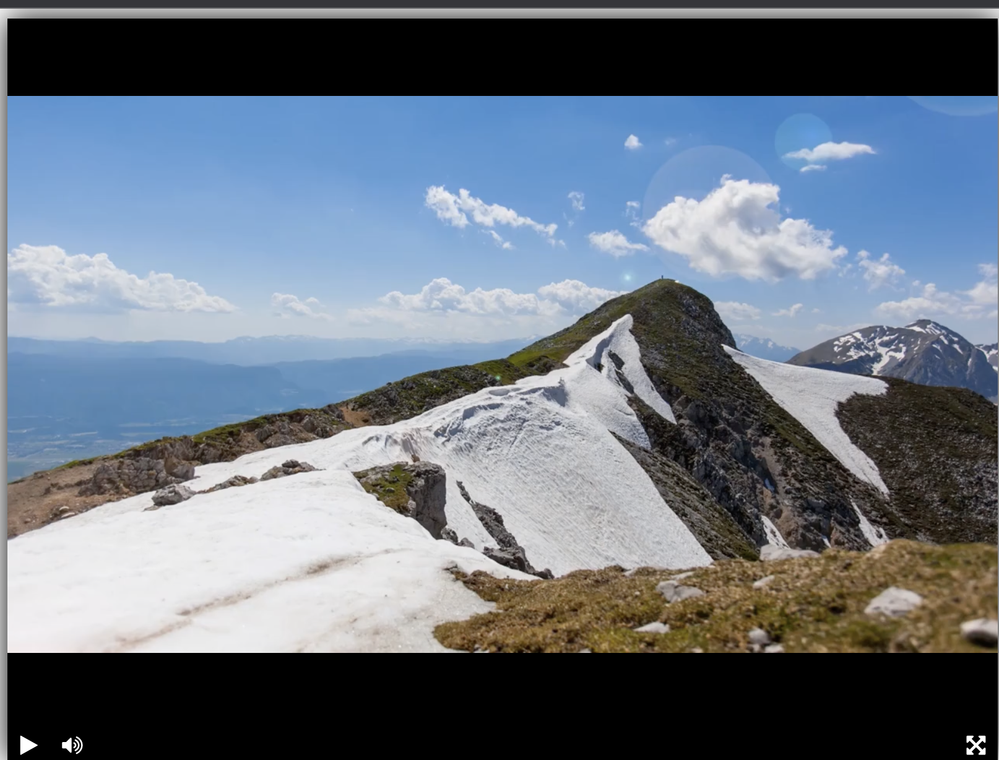

## Верстаем видеоплеер
Учебная верстка видеоплеера.  

В проекте используются шрифты [Font Awesome](https://fontawesome.ru/)  
Библиотека видеоплеера [тут](https://github.com/devmanorg/video-player-jslb).

Сайт с плеером можно увидеть [здесь](https://andrey7777777777.github.io/video_player_devman/)
### Цель проекта

Код написан в образовательных целях на онлайн-курсе для веб-разработчиков [dvmn.org](https://dvmn.org/).